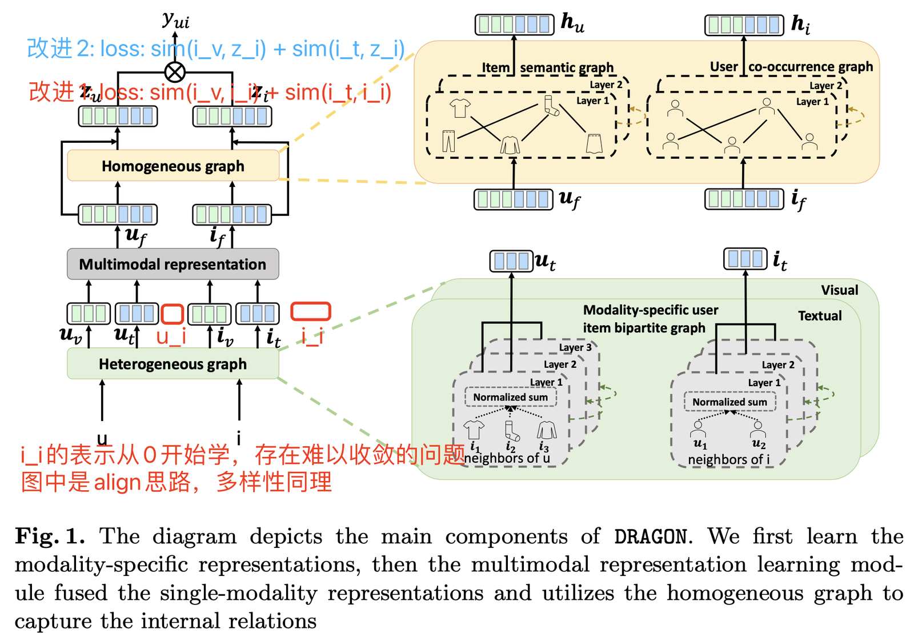

# 多模态推荐创新点梳理
## 20241113会议纪要
### 增加图文与item embedding对齐的效果对比
baseline：

使用图文与item 对齐的实验结果

改进点：1）额外增加item embedding的表示；2）增加图、文的embedding与item embedding对齐的loss，目前的loss为MSE
实验结论：在recall@5，recall@10及NDCG@5均是有效果的，说明改进方案排序更加精准
### 实验点改进

- 在图、文embedding与item 对齐的embedding时，尝试其他loss，比如coSent loss
- 新增准确率的评估指标
- 细化图文多样性的loss的方案

### 方案改进:
item embedding前置，上一个实验是另外增加item的embedding, 从0开始学习，计划改成user与item交叉的item embedding作为align的对齐标准，因为交叉前的embedding比学习更充分\
前后对比方法：

## 20240822
### 初步达成一致的优化点
#### 1.样本抽样优化
原有方法，根据边的度裁剪：
- 倾向保留度小的边，度比较大的边抽样保留的概率比较小（边的度定义：边两侧顶点的度），u，v , 边的抽样概率：1/|U|*|V|
- 随机去掉一些低度的边
优化：先分层节点，对密集的随机采样（来源日常生活）

#### 2.图文表示的优化(实现，效果不佳)
- 原有方法：图片和文本的表征采用带权求和的方式综合
- 优化：文本和图片的表示，采用cat操作，再接一个线性层MLP or MOE，而不是简单的带权重相加
讨论：
图文fusion：align（coattention），diversity（识别各自独特信息， cosine（emb（文本）-emb（id）,emb(图像)-emb（id）））--夹角大。
    - 1）避免多模态信息融合消息丢失[1,1,1] + [-1,-1,-1]
    - 2）align: 强化多模态的相似信息和不相似信息，
    - 3）diversity：考虑多模态信息的独特性，图文之间和id相近，但是又有不同。
    - 4）同时考虑多模态信息中的噪音。如图文不匹配的情况，挂羊头卖狗肉。
#### 3.综合多层user/item表示
原有方法：为add or sum

优化：改成线性加权求和 cat + MLP

### 待进一步讨论的点
1.ue的权重初始化，加速训练收敛速度
- 原有方法：随机初始化
优化：采用item的embedding初始化，加速收敛速度
说明：没有效果提升，可增加实验对比

#### 2.Heterogeneous Graph
	原有算法：

优化：改成attention机制，不需要做归一化，K，V来自i， Q为ego-u或第l层的u
说明：不确定效果，需要实验

#### 3.重新对多模信息编码
- 原有方法：直接使用已有的编码方案
优化：从头开始对齐图片和文本编码
说明：工作量较大，耗时较长，放到后面决定
可以加辅助损失，衡量多模态
#### 7.Homogeneous Graph环节引入transformer结构（初步实现，还需要优化改进）
dragon的这个论文中，在Homogeneous Graph部分，采用提前计算邻接矩阵相似度的方式计算权重，有如下不足：
- 计算user的相似topk的user，采用user-item-user的方式计算，这里边隐含了行为交互的信息。而label预测的时候也是行为交互产生的，这里导致了引入的信息冗余。
- 计算item的相似topk的item时，是提前计算相似邻接矩阵的，这些信息是最开始就固定了，无法随着item embedding的更新而更新，导致了信息滞后。
优化：
- 引入tranformer架构，在将第一阶段Heterogeneous Graph产生的user和item embeding后，将user和item看成是token。使用transformer架构进一步学习user和item之间的embedding，user的token和item的token可以分开学习，但模型权重共享（user一个batch，item一个batch）
- 初步改好跑了下，比较难收敛。但感觉这个思路没有问题
- 在标准transormer基础上改进：layerNorm改成batchNorm...

## 思考点
1.把多模结构做成标准结构，类似transformer

## 论文收集
1.AlignRec: Aligning and Training in Multimodal Recommendations

2.Enhancing Dyadic Relations with Homogeneous Graphs for Multimodal Recommendation

3.Enhancing Taobao Display Advertising with Multimodal Representations: Challenges, Approaches and Insights

4.Layer-refined Graph Convolutional Networks for Recommendation

5.Improving Multi-modal Recommender Systems by Denoising and Aligning Multi-modal Content and User Feedback

6.Multi-Modal Self-Supervised Learning for Recommendation

7.One Multimodal Plugin Enhancing All: CLIP-based Pre-training Multimodal Item Representations for Recommendation System

8.MMGCN: Multi-modal Graph Convolution Network for Personalized Recommendation of Micro-video

9.

